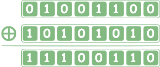
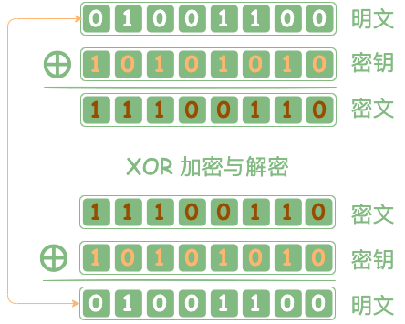

# 前言

## XOR 异或

!!! 1个比特的异或运算规则如下

    

        
0

        
XOR

        
0

        
=

        
0

    

    

        
0

        
XOR

        
1

        
=

        
1

    

    

        
1

        
XOR

        
0

        
=

        
1

    

    

        
1

        
XOR

        
1

        
=

        
0

    

> 异或操作可以想象成卡片翻转

假设 `0表示正面`， `1表示反面`

XOR后的操作数字1表示翻转，0表示不动

- 0 XOR 0 卡片正面， 没有翻转，还是正面 结果为0
- 0 XOR 1 卡片正面， 翻转一次，变成反面 结果为1
- 1 XOR 0 卡片反面，没有翻转，还是反面 结果为1
- 1 XOR 1 卡片反面，翻转一次，变为正面 结果为0

!!! 比特序列的XOR

    

> 比特序列的异或操作与单个比特操作同理，可以使用上面的卡片翻转理解。

!!! 最简易的对称加密与解密模型

    

原始`明文`经过密钥加密（XOR 异或操作后）得到密文，
密文与密钥再一次加密XOR 异或操作后）得到的结果，大家会发现又还原成了明文。

    这就是最简单的一个对称加密的示例。

整体的逻辑还是可以用之前的翻转卡片来理解，
明文经过 **翻转卡片(异或操作)** 后得到结果->密文，
密文经过相同的翻转规则后，又回到了原来的卡片状态。

